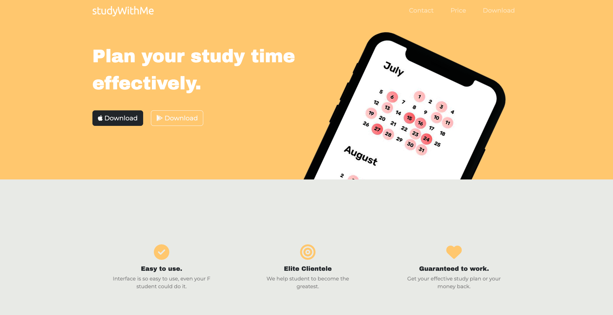
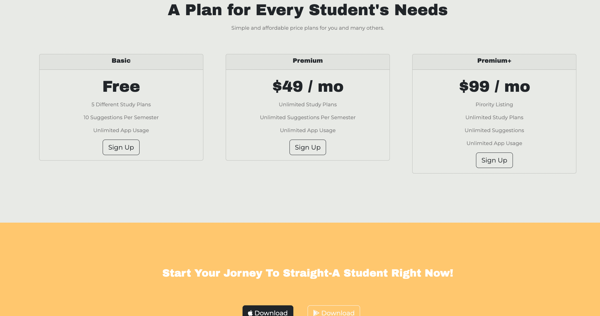

# studyWithMe-website

The website created for personal project 'studyWithMe'.   
Developed using Bootsrap framework and HTML/CSS/JS   

studyWithMe is project that has a goal to support students from around the world through schedule suggestions, personal tutors, academic progress monitoring, self analyzing and etc.

